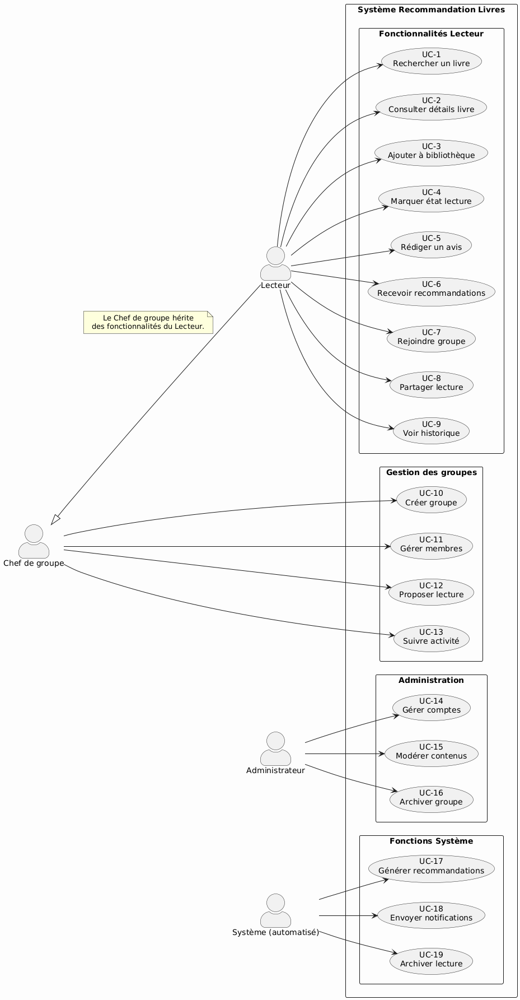
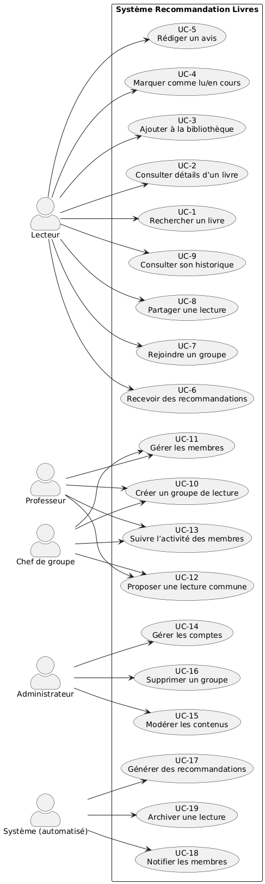
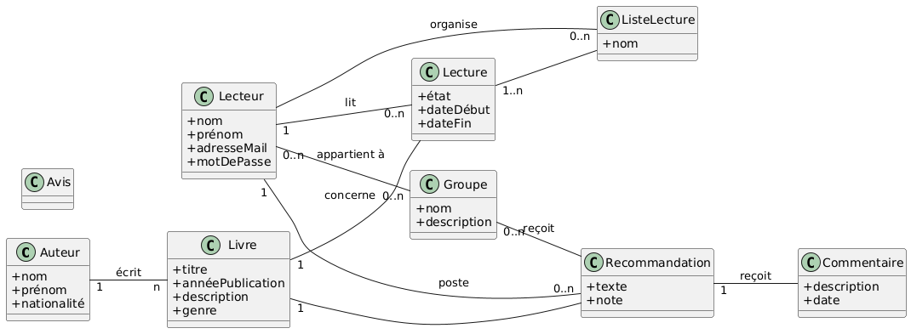

# Système de Recommandation de Livres

Ce dépôt contient la documentation fonctionnelle du projet de système de recommandation de livres, conçu pour répondre aux besoins variés des lecteurs en matière de découverte, de gestion et de partage de lectures

---

## 📂 Structure du dépôt

```
├── Acteurs/
│   ├── administrateur.md
│   ├── chef_de_groupe.md
│   ├── lecteur.md
│   ├── membre_club.md
│   ├── parent.md
│   ├── systeme_notification.md
│   └── systeme_recommandation.md
├── Diagrammes/
│   ├── diagramme_InteractionGenerale.png
│   ├── diagramme_MOD.png
│   └── diagramme_UseCase.png
├── UseCases/
│   ├── UC-6.md
│   ├── UC-12.md
├── Acteurs.md
├── Contexte.md
├── Glossaire.md
├── Perimetre.md
├── UseCases.md
```

---

## 📖 Contenu

1. **[Acteurs.md](Acteurs.md)**  
   Présentation synthétique des différents acteurs du système.

2. **Acteurs individuels**  
   - [lecteur.md](Acteurs/lecteur.md)  
   - [administrateur.md](Acteurs/administrateur.md)  
   - [chef_de_groupe.md](Acteurs/chef_de_groupe.md)  
   - [parent.md](Acteurs/parent.md)  
   - [membre_club.md](Acteurs/membre_club.md)  
   - [systeme_recommandation.md](Acteurs/systeme_recommandation.md)  
   - [systeme_notification.md](Acteurs/systeme_notification.md)

3. **[Contexte.md](Contexte.md)**  
   Présente les enjeux et le besoin du système de recommandation.

4. **[Perimetre.md](Perimetre.md)**  
   Décrit la frontière fonctionnelle du projet.

5. **[Glossaire.md](Glossaire.md)**  
   Définitions des termes clés employés dans le projet.

6. **[UseCases.md](UseCases.md)**  
   Liste globale des cas d'utilisation identifiés.

7. **Cas d'utilisation détaillés**  
   - [UC-6.md](UseCases/UC-6.md) : Recevoir des recommandations  
   - [UC-12.md](UseCases/UC-12.md) : Créer un groupe

8. **Diagrammes**  
   -   
   -   
   - 

---
